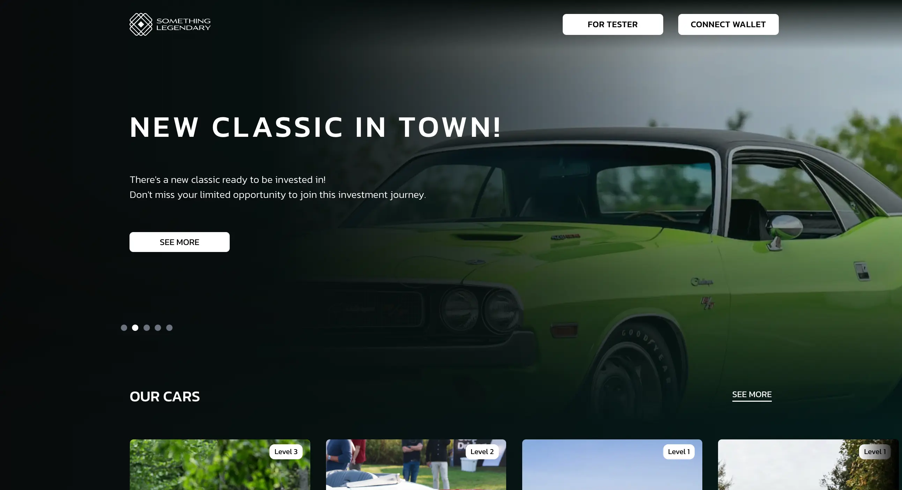

<div align="center">

  
  <h1>Something Legendary</h1>
  
  <p>
    Welcome to the Something Legendary Platform! 
  </p>
  
</div>

<br />

<!-- Table of Contents -->

# :notebook_with_decorative_cover: Table of Contents

- [About the Project](#star2-about-the-project)
  - [Screenshots](#camera-screenshots)
  - [Tech Stack](#space_invader-tech-stack)
  - [Features](#dart-features)
  - [Environment Variables](#key-environment-variables)
- [Getting Started](#toolbox-getting-started)
  - [Prerequisites](#bangbang-prerequisites)
  - [Run Locally](#running-run-locally)
- [Usage](#eyes-usage)
- [Roadmap](#compass-roadmap)
- [FAQ](#grey_question-faq)
- [License](#warning-license)
- [Contact](#handshake-contact)

<!-- About the Project -->

## :star2: About the Project

<!-- Screenshots -->

### :camera: Screenshots

<div align="center"> 
  
</div>

<!-- TechStack -->

### :space_invader: Tech Stack

<details>
  <summary>Client</summary>
  <ul>
    <li><a href="https://www.typescriptlang.org/">Typescript</a></li>
    <li><a href="https://nextjs.org/">Next.js</a></li>
    <li><a href="https://reactjs.org/">React.js</a></li>
    <li><a href="https://tailwindcss.com/">TailwindCSS</a></li>
    <li><a href="https://headlessui.com/">HeadlessUI</a></li>
    <li><a href="https://hardhat.org/">HardHat</a></li>
    <li><a href="https://wagmi.sh/">WAGMI</a></li>
    <li><a href="https://ethers.org/">ethers</a></li>
    <li><a href="https://photoswipe.com/">PhotoSwipe</a></li>
    <li><a href="https://swiperjs.com/">Swiper</a></li>

  </ul>
</details>

<details>
  <summary>Server</summary>
  <ul>
    <li><a href="https://www.typescriptlang.org/">Typescript</a></li>   
    <li><a href="https://www.hygraph.com/">Hygraph</a></li>
    <li><a href="https://github.com/jasonkuhrt/graphql-request/">graphql-request</a></li>

  </ul>
</details>

<details>
  <summary>Authentication</summary>
  <ul>
    <li><a href="https://github.com/nextauthjs/next-auth/">NextAuth.js</a></li>   
    <li><a href="https://login.xyz/">SIWE</a></li>
  </ul>
</details>

<!-- Features -->

### :dart: Features

- Feature 1
- Feature 2
- Feature 3

<!-- Env Variables -->

### :key: Environment Variables

To run this project, you will need to add the following environment variables to your .env file

`NEXT_PUBLIC_ALCHEMY_API_KEY`
`NEXT_PUBLIC_CHAIN_ID`
`NEXT_PUBLIC_CHAIN_NAME`
`NEXT_PUBLIC_FACTORY_ADDRESS`
`NEXT_PUBLIC_PAYMENT_TOKEN_ADDRESS`
`NEXT_PUBLIC_PUZZLE_ADDRESS`
`NEXT_PUBLIC_SLLOGIC_ADDRESS`

`ALCHEMY_URL_ID`
`APP_DOMAIN`
`ETHERSCAN_API_KEY`
`HYGRAPH_CONTENT_API`
`HYGRAPH_BEARER`
`HYGRAPH_READ_ONLY_KEY`
`NEXTAUTH_URL`
`NEXTAUTH_SECRET`
`PRIVATE_KEY`

<!-- Getting Started -->

## :toolbox: Getting Started

<!-- Prerequisites -->

### :bangbang: Prerequisites

This project uses pnpm as package manager

#### On Windows

##### Using PowerShell:

```bash
iwr https://get.pnpm.io/install.ps1 -useb | iex
```

#### On POSIX systems

```bash
curl -fsSL https://get.pnpm.io/install.sh | sh -
```

<!-- Run Locally -->

### :running: Run Locally

Clone the project

```bash
  git clone https://github.com/Web360Labs/SomethingLegendary-Platform.git
```

Go to the project directory

```bash
  cd SomethingLegendary-Platform
```

Install dependencies

```bash
  pnpm i
```

Start the server

```bash
  pnpm build && pnpm start
```

Start the server (Dev mode)

```bash
  pnpm dev
```

<!-- License -->

## :warning: License

Distributed under the no License. See LICENSE.txt for more information.

<!-- Contact -->

## :handshake: Contact

For more info, mail us at info@somethinglegendary.com
